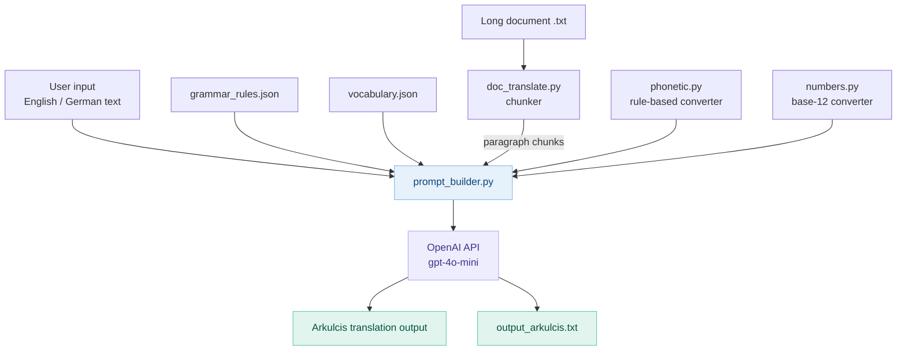

# Arkulcis — Architecture & AI Contribution

## System Overview

The Arkulcis project uses AI assistance at every stage of the software
development lifecycle: from language design through to testing and documentation.



## Human vs AI Roles

| Stage | Human | AI (tool used) |
|---|---|---|
| Language design | Defined all grammar rules, phonetic system, number system | ChatGPT/Gemini: brainstormed vocabulary, grammar edge cases |
| Vocabulary | Reviewed and approved all words | ChatGPT: generated initial word lists |
| Code implementation | Structured modules, reviewed logic | GitHub Copilot: generated boilerplate, unit tests |
| Translation engine | Wrote prompt, tuned temperature | OpenAI API: performs actual translation |
| Testing | Ran tests, fixed failures | GitHub Copilot: generated test cases |
| Documentation | Reviewed and edited | GitHub Copilot: generated docstrings and comments |

## Project Structure

```
arkulcis/
├── language_spec/
│   ├── grammar_rules.json     # All 13 Arkulcis grammar rules
│   └── vocabulary.json        # 150+ words across all word types
├── translator/
│   ├── phonetic.py            # Rule-based phonetic converter
│   ├── numbers.py             # Base-12 number system converter
│   ├── prompt_builder.py      # Builds LLM system prompt from spec files
│   └── translate.py           # Main translation engine (OpenAI API)
├── document_pipeline/
│   └── doc_translate.py       # Long document translation (chunked)
├── tests/
│   └── test_translate.py      # Pytest unit tests
├── docs/
│   └── architecture.md        # This file
├── .env.example               # API key template
├── requirements.txt           # Python dependencies
└── README.md                  # Project overview and setup guide
```

## Translation Pipeline Detail

### Single sentence
1. User provides English/German text
2. `prompt_builder.py` loads `grammar_rules.json` + `vocabulary.json`
3. A detailed system prompt is constructed encoding all 13 Arkulcis rules
4. OpenAI API (`gpt-4o-mini`) translates using the prompt as context
5. Output is returned as Arkulcis text

### Large document
1. `doc_translate.py` reads the `.txt` file
2. Text is split into paragraphs (blank-line separated)
3. Long paragraphs (>80 words) are further split into sentences
4. Each chunk is translated via the single-sentence pipeline
5. Chunks are reassembled and saved to `output_arkulcis.txt`

## Key Design Decisions

**Why gpt-4o-mini?**
Cheap, fast, and consistent enough for rule-following tasks. The system prompt
is detailed enough that the model mainly needs to apply substitution rules.

**Why low temperature (0.2)?**
Arkulcis translation is deterministic — there is only one correct answer for
each input. Low temperature reduces creative variation and improves rule adherence.

**Why split grammar + vocabulary into two JSON files?**
Separation of concerns: `grammar_rules.json` encodes structural rules (tenses,
suffixes, word order) while `vocabulary.json` encodes the lexicon. This makes
it easy to expand the vocabulary without touching the grammar spec.
